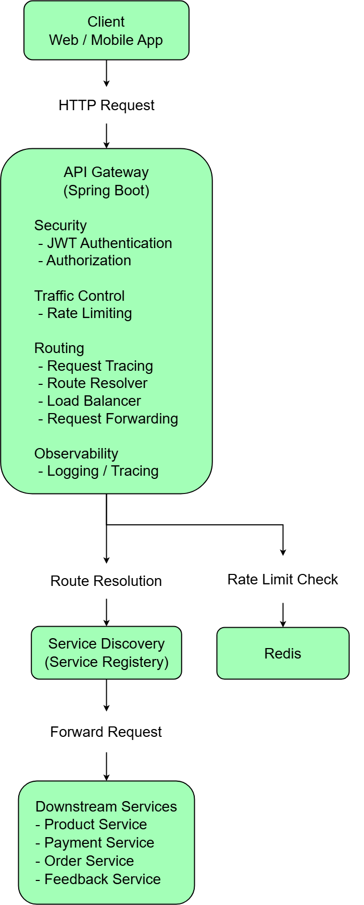

# Secure API Gateway with Distributed Features
This project focuses on understanding gateway internals rather than relying solely on framework abstractions.

## Overview

This project implements a custom API Gateway designed to centralize security, routing, and cross-cutting concerns for backend services in a microservices-style architecture.

The gateway acts as a single entry point for client requests, handling authentication, rate limiting, request tracing, and routing before forwarding traffic to downstream services.

The main goal of this project is to understand how API gateways work internally rather than relying entirely on frameworks such as Spring Cloud Gateway.

## Architecture

The system follows a gateway-based architecture where all client requests pass through the API Gateway before reaching backend services.

The gateway handles security, request routing, rate limiting, and tracing before forwarding requests to downstream services.

The diagram below illustrates the request flow and the internal components of the gateway.

## Request Flow

1. Client sends request to the API Gateway.
2. Gateway validates the JWT token using Spring Security.
3. Redis-based rate limiting ensures API usage is controlled per user.
4. A unique requestId is generated for request tracing.
5. Route Resolver determines the appropriate downstream service based on request path.
6. Service registry returns available instances for the target service.
7. Round-robin load balancing selects a service instance.
8. The request is forwarded to the downstream service using WebClient.
9. The response is returned back to the client through the gateway.

## Key Features

- JWT-based authentication and role-based authorization
- Path-based routing for downstream services
- Redis-backed distributed rate limiting
- Request tracing using correlation IDs
- Simulated service discovery
- Round-robin load balancing
- Downstream request forwarding using WebClient
- Global exception handling for consistent error responses

## Routing Strategy

The gateway uses path-based routing to determine the destination service.

| Path Pattern | Target Service |
|--------------|---------------|
| /product/** | product-service |
| /order/** | order-service |
| /payment/** | payment-service |

## Technology Stack

**Backend**
- Java 17
- Spring Boot
- Spring Security

**Infrastructure**
- Redis
- JWT

**Networking**
- WebClient

**Logging**
- Logback (MDC logging)

## Example Request

Client Request:

GET /feedback/list

Flow:

Client → API Gateway → Route Resolver → feedback-service → Response

## Running the Project

1. Clone the repository

2. Start Redis

3. Configure application properties

4. Run the Spring Boot application

5. Send requests through the gateway using Postman or curl

## Learning Goals

This project was built to understand the internal mechanics of an API Gateway, including routing strategies, distributed rate limiting, request tracing, and service discovery concepts used in microservices architectures.

## Future Improvements

- Integrate Spring Cloud Gateway
- Add circuit breaker support
- Dynamic route configuration
- OpenTelemetry distributed tracing
